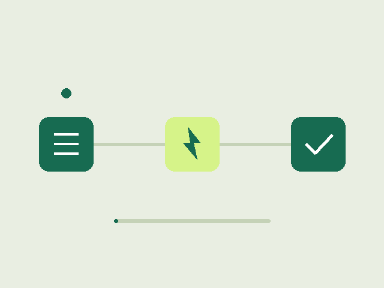

<!-- _class: cover -->

# 君とボク。

あらゆる現実を、自分の方に捻じ曲げたのだ。

---

<!-- _class: section -->

# 章のはじまり

次のスライドから実験に入る。

---

<!-- _footer: 通常のMarkdownだけを移している -->

# 実験室

減衰率は **黒字の太字**。<mark>アクセント</mark> は mark で書く。

> 引用は左にアクセントの線が付く。

- 通常の項目
- 入れ子
  - 小さい項目

| 名前  | 値  |
| ----- | --- |
| gamma | 0.2 |
| omega | 3.0 |

式は $E=mc^2$。

```
コードはそのまま等幅
```

---

<!-- _class: media -->

# 図



---

<!-- _class: essay -->

# 文章

このレイアウトは本文と見出しを一段小さくする。段落を重ねても、余白と文字の大きさは milo の essay に合わせてある。

次の段落も同じ大きさで流れる。リンクは [アクセント色](https://example.com) のまま。
